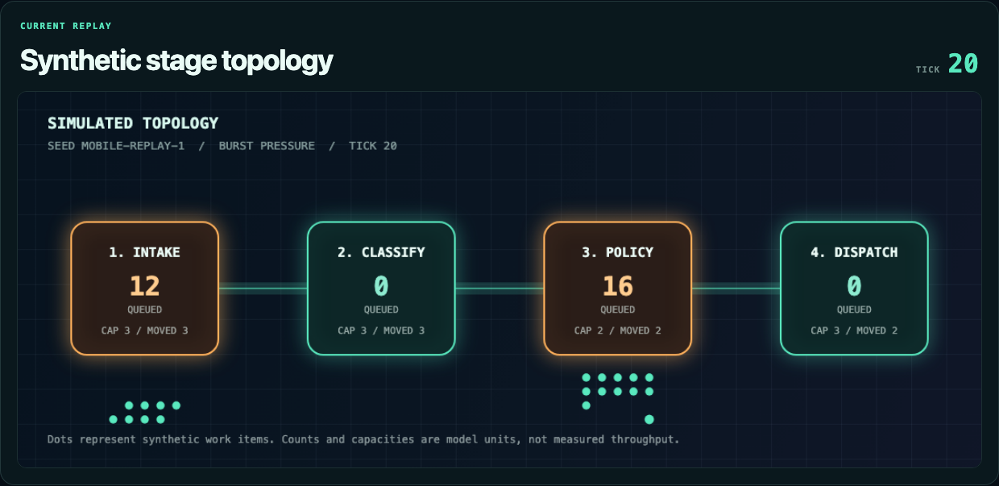

# Queueglass

**SIMULATED · LOCAL · SEEDED · REPLAYABLE**

A deterministic discrete-event laboratory for exploring queue pressure, stage capacity, retry decisions, and recovery. It is an educational model—not a monitored service, performance benchmark, AI agent, or description of production infrastructure.



## Truth boundary

Every displayed value is generated in the browser from a seed and one of three toy scenarios. The repository contains:

- no production telemetry or network client;
- no identity, account, communication, monetary, commercial, or staffing data;
- no AI inference or third-party services;
- no measured throughput, latency, accuracy, uptime, cost, savings, or service-level claims.

Item counts are synthetic. Capacity and compute are arbitrary model units. Latency is expressed only as **simulation ticks**. Outputs are not benchmarks, forecasts, architecture recommendations, or evidence of real operational performance.

## What can be explored

- **Nominal flow** — balanced synthetic arrivals and capacity.
- **Burst pressure** — a repeatable tick-bounded arrival surge and queue recovery.
- **Policy constrained** — a repeatable capacity reduction with seeded retry decisions.
- **Replay controls** — advance one or ten ticks, auto-run, pause, reset, derive a seed, and share `?seed=&scenario=` URLs.
- **Inspectability** — every stage exposes capacity, work moved this tick, and queued synthetic work.

The conservation invariant is explicit:

```text
synthetic arrivals = completed items + items still in the model
```

## Run locally

Requires Node.js 24 or a compatible Node release supported by Next.js 16.

```bash
npm ci
npm run dev
```

Open <http://localhost:3000/?seed=QUEUEGLASS-7&scenario=burst>.

## Verify

```bash
npm run verify
```

The verification gate scans for removed claim language and likely secrets, lints, type-checks, runs six deterministic/invariant tests, and creates a production build.

For the real-browser smoke, start the built app and run:

```bash
npm run build
npm run start -- -p 4173
# in another terminal
npm run test:browser
```

The browser smoke checks seed/scenario replay, step/reset, auto-run/pause, fullscreen/Escape, responsive layout, semantic state, and console errors. It refreshes the real capture in `docs/`.

## Automation hooks

- `window.render_game_to_text()` returns concise JSON containing the truth boundary, coordinate system, seed, scenario, tick, metrics, stages, current synthetic work, and recent model decisions.
- `window.advanceTime(ms)` advances fixed 600 ms simulation ticks without using wall-clock values in model state.

## Architecture

```text
src/lib/simulation.js          pure seeded state transitions
src/components/SimulatorLab   controls, topology canvas, provenance, state hooks
tests/simulation.test.js       replay and conservation invariants
scripts/browser-smoke.mjs      asserted Chromium interaction/capture
scripts/*-scan.mjs             release truth and secret gates
```

## Provenance

This public-facing lab is a clean-room reframing of a contained local interface prototype. The staged revival removed its original theatrical data generator, timer-driven metrics, unsupported operational language, named external connectors, and identity-like examples. No adjacent company documents, dashboards, notes, screenshots, workflows, or datasets were inspected or copied into this project.

## Limitations

- The queue model is intentionally small and single-process.
- Capacities, priorities, retries, and compute costs are pedagogical parameters.
- Scenario behavior is deterministic, not statistically calibrated.
- Browser automation currently targets Chromium.
- The project must not be presented as evidence about any company, product, team, deployment, or operating environment.

MIT licensed. Contributions that preserve the truth boundary are welcome; see [CONTRIBUTING.md](CONTRIBUTING.md).
